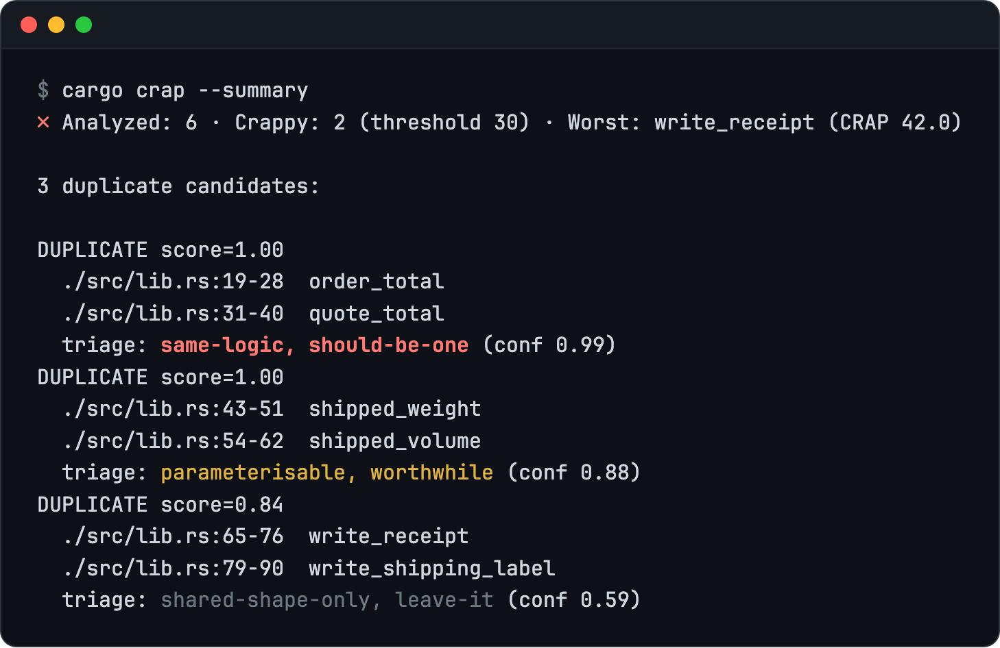

# Triaging duplicates

*Since 0.6.0. OpenAI as a provider since 0.7.0.*

Structural similarity cannot tell *the same logic written twice* from *two
unrelated functions that share a Rust idiom*. Two functions that are each a
run of `writeln!` calls score as high as a real copy-paste. Triage asks a
model three narrow questions about each reported pair and prints the answers
beside it. The model is [TypeSafe](https://docs.typesafe.ai) System One by
default, or the [OpenAI Decisions API](https://developers.openai.com/api/docs/guides/decisions)
([Choosing a provider](#choosing-a-provider)). On
[a small shop backend](../../examples/triage-demo) with three look-alike
pairs, a real run prints:



The first pair is one routine pasted and renamed. The second differs only in
the field it adds up. The last pair scores 0.84 on structure because both are
a run of `writeln!` calls, and triage says to leave it.

## Why turn it on

Without triage, `--duplicates` gives a similarity score and nothing else, and
that score does not say what to do. In the run above all three pairs score
0.84 or higher, yet one should be merged now, one needs a parameter first,
and one should be left alone. On a real codebase the list runs to dozens of
pairs, and reading each one to find the few worth merging is the slow part.
Triage does that first pass.

It also asks something structure cannot see: whether a fix to one side of a
pair would be missed in the other. That divergence risk (`divergence_risk`
in the JSON) points at the copies where a bug fix is most likely to reach
only one side.

The answers are typed, not prose. Either provider's model picks the kind
from a fixed list, places the pair on a fixed four-level scale, returns a
probability for the divergence question, and reports how confident it is.
cargo-crap can print, cache and test answers like that, and when the model
is not confident enough it says `uncertain` instead of passing on a guess.
The same answers print the same way whichever provider gave them.

## Reading the verdict

The kind is one of `same-logic`, `shared-shape-only`,
`structural-obligation` or `parameterisable`. The second word says whether
the pair is worth merging (`leave-it`, `optional`, `worthwhile`,
`should-be-one`). Below the confidence floor (`confidence-floor`, 0.5 by
default) the line says `triage: uncertain` and names no kind. On a colour
terminal the verdict is coloured by what it asks of you: bold red for
`should-be-one`, yellow for `worthwhile`, dim for `leave-it` and
`uncertain`. `NO_COLOR`, pipes and `--output` files get plain text. With
`--format json` each pair carries the same verdict as a `triage` object: its
kind, worth-extracting level and score, divergence risk and confidence, or
only `"kind": "uncertain"` and the confidence when below the floor. The key
is absent when triage did not run. For the first pair above:

```json
"triage": {
  "kind": "same-logic",
  "worth_extracting": "should-be-one",
  "worth_extracting_score": 2.93,
  "divergence_risk": 0.65,
  "confidence": 1.0
}
```

## Turning it on

It is opt-in twice over, because it sends each pair's two function bodies to
a third-party API:

1. **Build it in.** The HTTP client sits behind the `triage` Cargo feature.
   The release binaries, from `cargo binstall` or the release downloads, are
   built with it and do nothing with it until step 2. A source install leaves
   it out and compiles no network code at all unless you ask for it:

   ```bash
   cargo install cargo-crap --features triage
   ```

2. **Switch it on** in `.cargo-crap.toml` (there is no flag), and put the
   provider's key in the environment. It is never read from the config file:

   ```toml
   [duplicates.triage]
   enabled = true
   provider = "typesafe"   # the default, or "openai"
   ```

   ```bash
   export TYPESAFE_API_KEY=...   # or OPENAI_API_KEY for provider = "openai"
   cargo crap --path src --duplicates
   ```

Triage only annotates: every pair still prints in the same order with the
same score, and the exit code never depends on it. Without a key, a network
or a working API, the run prints the untriaged section and one warning
saying why.

Verdicts are cached in `cargo-crap/triage/` under the target directory:
`CARGO_TARGET_DIR` when it is set, otherwise `target/` beside
`.cargo-crap.toml`. The cache is keyed by both function bodies, the model
and the provider, so an unchanged pair is never asked about twice, switching
provider never reuses the other provider's verdicts, and `cargo clean`
removes it.

## Choosing a provider

`provider` in `[duplicates.triage]` picks the API. An unknown name is a
configuration error before anything is analyzed. Each provider reads only
its own environment variables:

| `provider`             | Key variable       | Base URL variable   | Default base URL            | Default `model` |
| ---------------------- | ------------------ | ------------------- | --------------------------- | --------------- |
| `typesafe` (default)   | `TYPESAFE_API_KEY` | `TYPESAFE_BASE_URL` | `https://api.typesafe.ai`   | `jev-latest`    |
| `openai`               | `OPENAI_API_KEY`   | `OPENAI_BASE_URL`   | `https://api.openai.com/v1` | `gpt-6-luna`    |

`model` overrides the provider's default. `OPENAI_BASE_URL` includes `/v1`,
as it does for OpenAI's own SDKs, so a proxy or gateway already set up for
them works here too. A key set for one provider is never sent to another.

Whichever you pick receives, for every pair it is asked about, the two
function bodies, their names, their file paths and line ranges, and the
similarity score. Nothing else leaves the project.

Each provider calibrates its own confidence, so the same
`confidence-floor` can mark a different share of pairs `uncertain` under
each. A question the OpenAI model declines to answer counts as a failure:
the run prints the untriaged section and one warning naming the question,
as for any other failure.
